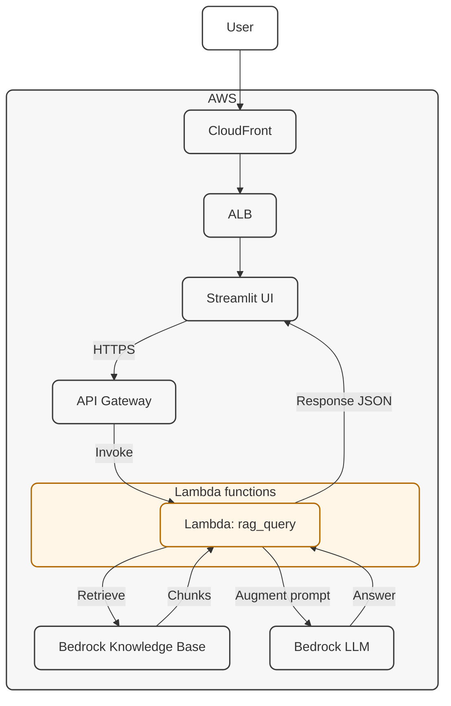
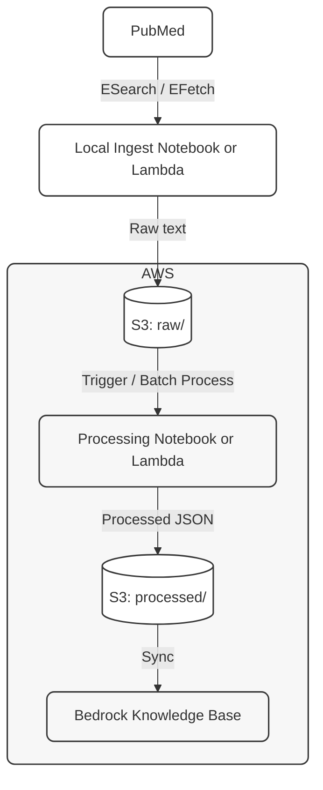
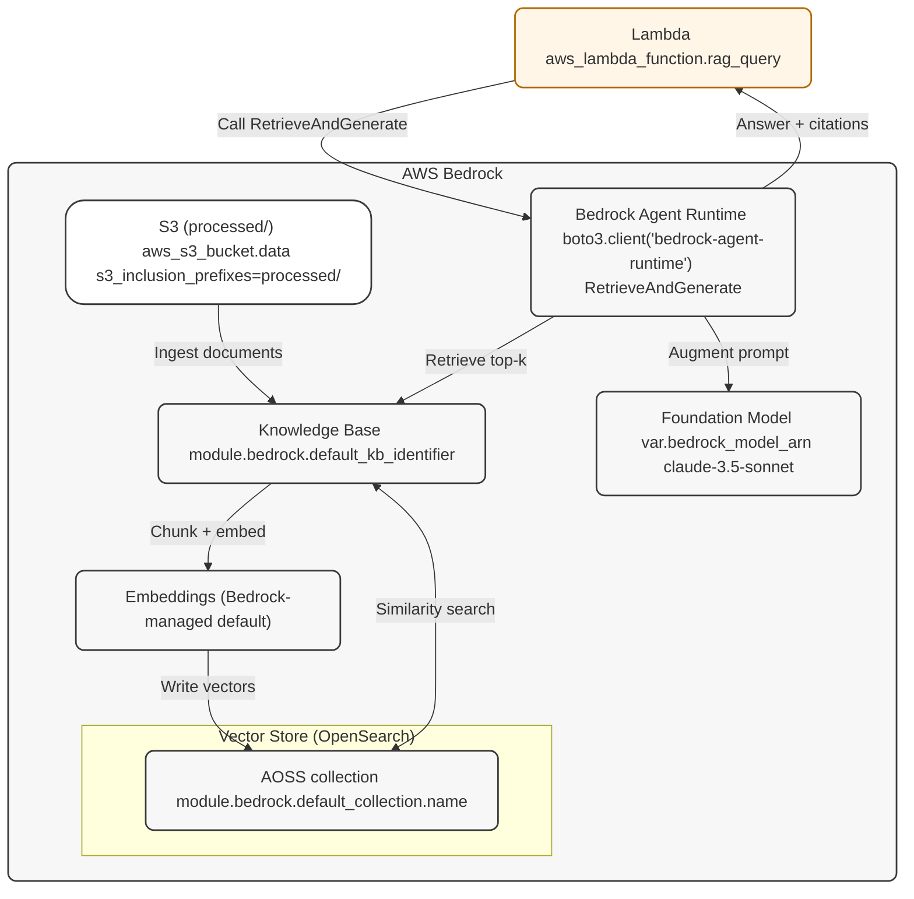

# Architecture

This document describes Mamoru’s architecture in three views: the high level **Cloud Deployment** view, the **Data Ingestion** view (pipeline into the Knowledge Base), and **Bedrock Zoomed In** view (how retrieval and generation work inside AWS Bedrock).

**Note:** The diagrams below do not depict ECS (where the Streamlit UI runs) or IAM roles and policies.

---

## 1. Cloud Deployment

A user accesses Mamoru through CloudFront, which handles HTTPS and global edge caching. Requests are routed through an Application Load Balancer to the Streamlit UI, which serves the interactive experience. When a user submits a question, the UI makes a secure call to API Gateway. API Gateway invokes a single Lambda function (`rag_handler`), which orchestrates the request. The Lambda first retrieves relevant context from the Bedrock Knowledge Base. Those retrieved chunks are used to augment the prompt sent to the Bedrock LLM. The LLM generates an answer grounded in the retrieved literature. The Lambda returns a structured JSON response back to the UI. The UI renders the response to the user, completing the RAG loop.

---

## 2. Data Ingestion

We start with PubMed, pulling peer-reviewed clinical literature using standard ESearch / EFetch APIs. Articles are collected by a local ingest notebook or Lambda, focused purely on retrieval, not interpretation. The raw content is stored in S3 (`raw/`) as a durable source of truth so it can be reprocessed over time. A processing step cleans, chunks, and adds metadata needed for retrieval. The processed output is written to S3 (`processed/`) as structured JSON. That data is then synced into a Bedrock Knowledge Base, where it’s embedded and indexed. The key idea is separation of concerns: raw data is preserved, processing is repeatable, and indexing is managed by AWS.

---

## 3. Bedrock Zoomed In

The flow starts in the Lambda (`rag_query`), which is responsible only for orchestration, not retrieval logic. The Lambda calls Bedrock Agent Runtime using the RetrieveAndGenerate API. Bedrock pulls documents from the Knowledge Base, which is backed by an S3 `processed/` prefix defined in Terraform. During ingestion, the Knowledge Base chunks the documents and generates embeddings using a Bedrock-managed default embedding model. Those embeddings are stored in OpenSearch Serverless, which acts as the vector store. At query time, Bedrock performs a top-k similarity search against the vector store to find the most relevant chunks. The retrieved context is then used to augment the prompt sent to the foundation model. The Claude 3.5 Sonnet model generates an answer grounded in the retrieved content. Bedrock returns the answer along with citations, which the Lambda passes back to the application.

