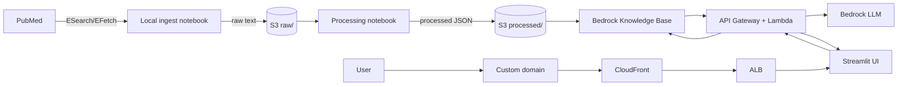

# Mamoru Project: A PubMed RAG Based System

This project builds a retrieval-augmented generation system using papers from PubMed to answer caregiver and clinician-oriented questions about dementia progression and care using peer-reviewed clinical literature.  See our [mock pitch deck](https://docs.google.com/presentation/d/1pU9SLoW5Ash5Qy7y0O62F0xYvQ3ghYX6LY4keAH-xtI/edit?usp=sharing) for more details about where things will go in the future.

## The Story of Mamoru Project
Mamoru (守る) is a Japanese verb that means to protect, to safeguard, to watch over.
It’s often used not for objects, but for people, traditions, and responsibilities entrusted to someone’s care.

Mamoru Project is built on that idea.

As people age or experience cognitive decline, knowledge doesn’t disappear; it becomes something others must hold, protect, and carry forward. Caregivers, clinicians, and families step into that role every day, often without clear, trustworthy tools to help them make sense of complex medical information.

## How To Use The Product
1. Go to https://mamoruproject.org/
2. Ask your questions and review the response + sources.


## Architecture Overview
- Ingest PubMed articles with NCBI E-utilities and store raw/processed data in S3.
- Chunk and embed text with AWS Bedrock and store vectors in Bedrock Knowledge Bases.
- Serve a single-turn Q&A endpoint via AWS Lambda + API Gateway.
- Provide a minimal Streamlit UI for querying with sources.


(note this was generated by an LLM)

## Repository Layout
- `api/`: Lambda handlers for ingest + query.
- `ui/`: Streamlit app.
- `docs/adr/`: Architecture Decision Records.
- `notebooks/`: Local exploration notebooks.
- `terraform/`: AWS infrastructure (S3, Bedrock KB, API, Streamlit).
- `assets/`: Project images (logo, screenshots).

## Development Approach
Given the time constraints, my initial implementation sprint focused most on the search/fetch notebook and the
query + ingest handlers, which were heavily influenced by the [boto3](https://boto3.amazonaws.com/v1/documentation/api/latest/reference/services/bedrock-agent-runtime.html) and [Biopython](https://biopython.org/docs/latest/Tutorial/chapter_entrez.html) docs.
The Terraform and Streamlit logic were stubbed out and adapted using a Plan and
Execute workflow similar to Eric Ma's approach, using Cursor and GPT-5.2 Codex
in a chaperoned fashion ([source](https://www.youtube.com/watch?v=YuA_9x1aSZ4)).
I intentionally skipped adding full static typing to the Python code here, but in a longer-lived production service I would normally add type hints and a type checker (for example, mypy or Pyright) to keep the codebase safer to change.

## Contributing
This repo includes a `Makefile` with common development tasks. To get started:

- Create and activate a virtual environment:
  - `python -m venv .venv`
  - `source .venv/bin/activate` (or `.venv\Scripts\activate` on Windows)
- Install dependencies:
  - `pip install -r requirements.txt`
- Set up pre-commit hooks:
  - `make precommit-install`
- Run tests:
  - `make test`
- Run the Streamlit UI locally:
  - `make run-ui` (loads `.env` if present, then starts Streamlit)

See `Makefile` for all available targets: `precommit-install`, `precommit-run`, `clean-notebooks`, `test`, `run-ui`, `run-fetch`, `run-process`, `terraform-init`, `terraform-validate`, `terraform-plan`, `terraform-apply`, `build-push-ui`, `bump-patch`, `bump-minor`, `bump-major`, `tag-release`.

If you want to propose changes, open a pull request so it can be reviewed.

## ADRs
Create ADRs in `docs/adr/` to capture key decisions (e.g., chunk size, embedding model, vector DB choice).

## GitHub Actions
Workflows live in `.github/workflows/`:
- **Tag release**: On merge to `main`, create a tag `v<VERSION>` when the `VERSION` file changes.
- **Tests + Black**: On PRs, run `black --check .` and `pytest -q`.
- **ECR push**: On merge to `main`, build/push `pubmed-rag-ui-repo:v<VERSION>` when `VERSION` changes.

**Repo Variables** (non-secret):
- `AWS_REGION` (e.g. `us-east-1`)
- `AWS_ACCOUNT_ID` (e.g. `934888692597`)

**Repo Secrets**:
- `AWS_ACCESS_KEY_ID`
- `AWS_SECRET_ACCESS_KEY`

## Local Development

### Running Streamlit UI Locally
Use the Makefile target for convenience:
```bash
make build-push-ui && make run-ui
```

Or run manually:
1. **Set up environment** (if not already done):
   ```bash
   python -m venv .venv
   source .venv/bin/activate  # On Windows: .venv\Scripts\activate
   ```

2. **Install UI dependencies**:
   ```bash
   pip install -r ui/requirements.txt
   ```

3. **Run the Streamlit app**:
   ```bash
   streamlit run ui/app.py
   ```
   The app will open in your browser at `http://localhost:8501`.

**Note**: The app defaults to the deployed API endpoint. Set `RAG_API_URL` in your `.env` to override.

### Local Data Ingestion
You can run ingestion locally in a Jupyter notebook for quick iteration:

1. Create and activate a virtual environment, then install requirements:
   - `python -m venv .venv`
   - `source .venv/bin/activate`
   - `pip install -r requirements.txt`
2. Create a local `.env` (gitignored) with:
   - `NCBI_EMAIL=you@example.com`
   - `NCBI_API_KEY=your_key_here` (optional)
   - `S3_BUCKET=your-bucket`
   - `BEDROCK_KB_ID=kb-XXXXXXXXXX`
   - `BEDROCK_MODEL_ARN=...` (optional)
   - `RAG_API_URL=...` (optional, Streamlit UI)
   - `OPENSEARCH_ADMIN_PRINCIPAL=arn:aws:iam::ACCOUNT_ID:user/USERNAME` or `arn:aws:iam::ACCOUNT_ID:role/ROLE_NAME` (optional, for Terraform OpenSearch access; auto-detected from current AWS identity)
3. Launch Jupyter Notebook:
   - `jupyter notebook`
4. Open `notebooks/pubmed_search_and_fetch.ipynb` and run the cells.

### RAG Prototype (Notebook)
Use `notebooks/pubmed_rag_prototype.ipynb` for local retrieval and answer generation.
Set `BEDROCK_KB_ID` and `BEDROCK_MODEL_ARN` in `.env`.

## Infrastructure

### Terraform
Current Terraform covers:
- **S3** bucket for raw/processed corpus storage
- **Bedrock Knowledge Base** (vector store backed by OpenSearch Serverless)
- **S3 data source** scoped to the `processed/` prefix
- **Secrets Manager** secret for NCBI credentials (`ncbi_email`, `ncbi_api_key`)
- **Lambda functions** for ingest and query
- **API Gateway** HTTP API for RAG queries
- **Streamlit app** (serverless via ECS/Fargate)
- **Route53 + CloudFront** for custom domain

Tags are applied via the `tags` variable (default: `project=pubmed-rag-system`, `env=production`).

Required inputs:
- `bucket_name` (no default)
- `ncbi_email` (no default)

See `terraform/README.md` for detailed Terraform documentation.

### Deployment

**Note**: Ensure your domain registrar (e.g. `mamoruproject.org`) points to the correct Route 53 hosted zone (or add the domain manually in your DNS provider) before expecting ACM validation to complete.

#### Using Makefile Targets

The Makefile provides convenient targets for Terraform operations:

- `make terraform-init` - Initialize Terraform (run once, or after adding providers)
- `make terraform-validate` - Validate Terraform configuration
- `make terraform-plan` - Show planned changes
- `make terraform-apply` - Apply Terraform changes
- `make build-push-ui` - Build and push Streamlit Docker image to ECR

#### Deployment Steps

1) **Initialize Terraform** (first time only):
   ```bash
   make terraform-init
   ```

2) **Plan and apply core infrastructure**:
   ```bash
   make terraform-plan
   make terraform-apply
   ```
   
   For a two-phase apply (if needed), use targeted plans:
   ```bash
   cd terraform
   terraform plan -target=aws_s3_bucket.data -target=aws_s3_bucket_versioning.data -target=aws_s3_bucket_server_side_encryption_configuration.data -target=aws_s3_bucket_public_access_block.data -target=aws_secretsmanager_secret.ncbi_credentials -target=aws_secretsmanager_secret_version.ncbi_credentials -target=module.bedrock -target=aws_iam_role.rag_lambda -target=aws_iam_role_policy.rag_lambda -target=aws_lambda_function.rag_query -target=aws_apigatewayv2_api.rag_api -target=aws_apigatewayv2_integration.rag_api -target=aws_apigatewayv2_route.rag_query -target=aws_apigatewayv2_stage.rag_api -target=aws_lambda_permission.rag_api
   terraform apply
   ```

3) **Build and push Streamlit image**:
   ```bash
   make bump-patch  # Bump version first (or bump-minor/bump-major)
   make build-push-ui
   ```
   **Important**: Always bump the version (`make bump-patch`, `make bump-minor`, or `make bump-major`) before deploying a new image. This ensures ECS pulls the new image instead of using a cached version. The version is automatically passed to Docker as a build argument and written to the container.
   
   After building the image, run `make terraform-apply` to update the infrastructure with the new image version.

   **Note**: When updating `ui/app.py`, ensure `streamlit_app_version` in `terraform/variables.tf` is aligned with `VERSION` before applying. The `build-push-ui` target uses `VERSION` automatically, and `bump2version` updates both files.

4) **Set the NCBI secret value**:
   - The Terraform apply creates the secret but does not populate values.
   - Console:
     - Open the secret in Secrets Manager and set the JSON value for `ncbi_email` and `ncbi_api_key`:
       - `{"ncbi_email":"you@example.com","ncbi_api_key":"REPLACE_ME"}`
   - CLI (example):
     - `aws secretsmanager put-secret-value --secret-id pubmed-ncbi-credentials --secret-string '{"ncbi_email":"you@example.com","ncbi_api_key":"REPLACE_ME"}'`

### RAG API + Streamlit UI
Terraform provisions a Lambda-backed HTTP API for RAG queries and an optional serverless Streamlit app. The UI can use the API endpoint from Terraform outputs:
- `rag_api_endpoint` (HTTP API base URL)
- `streamlit_cloudfront_url` (Streamlit UI URL)

## Data Pipeline

### PubMed Ingest

#### Manual Ingest Trigger
Invoke the ingest Lambda manually to pull new PubMed records into `raw/`:
- `aws lambda invoke --function-name <pubmed_ingest_lambda_name> --payload '{}' /tmp/ingest.json`
- Adjust query or limits by updating Terraform variables: `pubmed_query`, `pubmed_retmax`, `pubmed_batch_size`

The knowledge base uses a curated subset of dementia and caregiver-related peer-reviewed articles from PubMed to inform research-backed answers.

#### Secrets + Scheduling
- Secrets: store `NCBI_EMAIL` and `NCBI_API_KEY` in AWS Secrets Manager
- Scheduling: use EventBridge to trigger a Lambda (or ECS task) for periodic ingest.
- Details: `docs/ops/scheduled_ingest.md`

#### Troubleshooting OpenSearch Permissions
If you encounter a 403 Forbidden error when creating the OpenSearch index, the access policy may need to be refreshed. The policy should automatically include your current user ARN, but if issues persist:

1. Verify your user ARN is in the access policy:
   ```bash
   aws opensearchserverless get-access-policy --name os-access-pubmed-rag-api --type data --region us-east-1
   ```

2. If needed, manually update the policy to include your user ARN (the policy name format is `os-access-<prefix>` where prefix is the first 16 chars of `rag_api_name`).

3. Ensure `OPENSEARCH_ADMIN_PRINCIPAL` in `.env` matches your IAM user or SSO role ARN (optional, as it's auto-detected from `aws sts get-caller-identity`). For SSO users, you may need to add the SSO role ARN explicitly:
   ```bash
   # Find your SSO role ARN
   aws iam list-roles --query "Roles[?contains(RoleName, 'SSO')].Arn" --output text
   # Add it to .env as OPENSEARCH_ADMIN_PRINCIPAL
   ```

## Operations

### Query Logs
The Streamlit UI logs each question to stdout. When deployed, these logs are available in CloudWatch Logs under the ECS log group created by the module:
- Log group: `/ecs/<app_name>-ecs-log-group`
- Filter example: `fields @timestamp, @message | filter @message like /rag_query:/ | sort @timestamp desc`

### Cleanup
- `terraform destroy` to remove AWS resources created by this repo.
- Remove generated S3 data under `s3://<bucket>/raw/` and `s3://<bucket>/processed/` if needed.
- Unsubscribe and delete SNS topics if you no longer want alerts.
- Delete ECR images for the Streamlit app if you no longer need the UI.

### Estimated Cost
Order-of-magnitude estimates (us-east-1). Assumptions: 500 documents ingested,
weekly ingest run, 100–1,000 Q&A requests per month, and a single Streamlit task.

- **Baseline infra** (OpenSearch Serverless + ECS/ALB + CloudFront): ~`$75–$200/mo`
  even with light traffic.
- **Bedrock per-request**: typically `low cents` per request.
  Roughly `~$1–$10/mo` for ~100 queries, `~$10–$100/mo` for ~1,000 queries
  (depends on model choice and response length).
- **Ingest processing (Lambda)**: usually `<$1–$5/mo` for a small weekly run.
  If you run daily or process thousands of documents, expect `~$5–$20/mo`.
- **S3 + CloudWatch**: usually `a few dollars` unless data or logs grow large.

## Future Roadmap
Once the product is considered viable, possible next steps include:
1. Adding auth, encoding the API endpoint and setting per-user rate limits.
1. Migrating away from Streamlit to a static React frontend behind a WAF, and reviewing CIS benchmarks / hardening the production environment.
1. Creating a dedicated stage environment and wiring up CI/CD to promote changes from stage to prod.
1. Locking down credentials further (e.g., narrower IAM policies, secret rotation).
1. Expanding test coverage for Lambdas, data parsing, and infra integration flows.
1. Implementing LangChain evaluation framework to measure RAG quality (faithfulness, answer relevance, context precision) and track improvements over time.
1. Expanding ingest to pull full article content from PubMed Central when available, falling back to abstracts for articles without open access full text.
