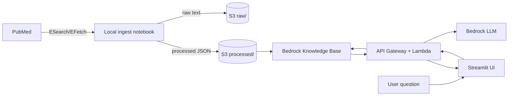

# PubMed RAG System

This project builds a retrieval-augmented generation (RAG) system over PubMed to answer caregiver and clinician-oriented questions about dementia progression and care using peer-reviewed clinical literature.

## Overview
- Ingest PubMed articles with NCBI E-utilities and store raw/processed data in S3.
- Chunk and embed text with AWS Bedrock and store vectors in Bedrock Knowledge Bases.
- Serve a single-turn Q&A endpoint via AWS Lambda + API Gateway.
- Provide a minimal Streamlit UI for querying with sources.

## Architecture Diagram

## Repository Layout
- `ingest/`: PubMed fetch scripts.
- `processing/`: Chunking, embeddings, and indexing.
- `rag/`: Retrieval and prompt assembly logic.
- `api/`: TBA.
- `ui/`: TBA Streamlit app.
- `docs/adr/`: Architecture Decision Records.
- `notebooks/`: Local exploration notebooks.

## Local Data Ingestion (Notebook)
You can run ingestion locally in a Jupyter notebook for quick iteration:

1. Create and activate a virtual environment, then install requirements:
   - `python -m venv .venv`
   - `source .venv/bin/activate`
   - `pip install -r requirements.txt`
2. Create a local `.env` (gitignored) with:
   - `NCBI_EMAIL=you@example.com`
   - `NCBI_API_KEY=your_key_here` (optional)
3. Launch Jupyter Notebook (no Lab required):
   - `jupyter notebook`
4. Open `notebooks/pubmed_search_and_fetch.ipynb` and run the cells.

## Project checklist
- [x] Local PubMed ingest (Jupyter notebook)
- [x] Repo scaffolding and config
- [x] Terraform: S3 buckets (raw + processed)
- [ ] Upload raw PubMed data to S3
- [x] Enable AWS Bedrock and IAM permissions
- [ ] Embedding + vector index job
- [ ] RAG retrieval and answer logic (local)
- [ ] Lambda inference API (API Gateway)
- [ ] Streamlit app (local)
- [ ] Deploy Streamlit with terraform-aws-serverless-streamlit-app
- [ ] Route 53 domain + HTTPS
- [ ] README, demo prep, and design explanations

## Terraform (What It Provisions)
Current Terraform covers:
- **S3** bucket for raw/processed corpus storage
- **Bedrock Knowledge Base** (vector store backed by OpenSearch Serverless)
- **S3 data source** scoped to the `processed/` prefix
- **Secrets Manager** secret for NCBI credentials (`ncbi_email`, `ncbi_api_key`)

Tags are applied via the `tags` variable (default: `project=pubmed-rag-system`, `env=production`).

## Deployment
Minimal AWS services (details to be documented in this repo):
- **S3** for raw/processed corpus storage
- **Bedrock Knowledge Bases** for vector storage and retrieval
- **Bedrock** for embeddings + LLM
- **Lambda + API Gateway** for scalable inference endpoint
- **Streamlit** for UI (local or hosted)

## Secrets + Scheduling
- Secrets: store `NCBI_EMAIL` and `NCBI_API_KEY` in AWS Secrets Manager (no plaintext in repo).
- Scheduling: use EventBridge to trigger a Lambda (or ECS task) for periodic ingest.
- Details: `docs/ops/scheduled_ingest.md`

## ADRs
Create ADRs in `docs/adr/` to capture key decisions (e.g., chunk size, embedding model, vector DB choice).
