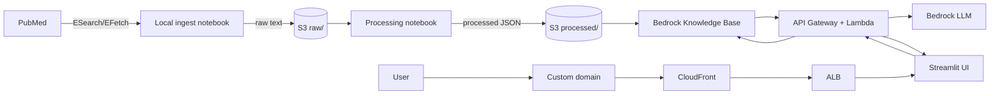

# Mamoru Project: A PubMed RAG Based System

This project builds a retrieval-augmented generation (RAG) system over PubMed to answer caregiver and clinician-oriented questions about dementia progression and care using peer-reviewed clinical literature.

## The Story of Mamoru Project
Mamoru (守る) is a Japanese verb that means to protect, to safeguard, to watch over.
It’s often used not for objects, but for people, traditions, and responsibilities entrusted to someone’s care.

Mamoru Project is built on that idea.

As people age or experience cognitive decline, knowledge doesn’t disappear, it becomes something others must hold, protect, and carry forward. Caregivers, clinicians, and families step into that role every day, often without clear, trustworthy tools to help them make sense of complex medical information.

Mamoru Project exists to safeguard knowledge on behalf of those who can’t always access it themselves.

## Overview
- Ingest PubMed articles with NCBI E-utilities and store raw/processed data in S3.
- Chunk and embed text with AWS Bedrock and store vectors in Bedrock Knowledge Bases.
- Serve a single-turn Q&A endpoint via AWS Lambda + API Gateway.
- Provide a minimal Streamlit UI for querying with sources.

## Architecture Diagram

## Repository Layout
- `rag/`: Retrieval and prompt assembly logic.
- `api/`: TBA.
- `ui/`: TBA Streamlit app.
- `docs/adr/`: Architecture Decision Records.
- `notebooks/`: Local exploration notebooks.

## Local Data Ingestion (Notebook)
You can run ingestion locally in a Jupyter notebook for quick iteration:

1. Create and activate a virtual environment, then install requirements:
   - `python -m venv .venv`
   - `source .venv/bin/activate`
   - `pip install -r requirements.txt`
2. Create a local `.env` (gitignored) with:
   - `NCBI_EMAIL=you@example.com`
   - `NCBI_API_KEY=your_key_here` (optional)
   - `S3_BUCKET=your-bucket` (for uploads)
   - `BEDROCK_KB_ID=kb-XXXXXXXXXX` (for RAG prototype)
   - `BEDROCK_MODEL_ARN=...` (optional, defaults in notebook)
   - `RAG_API_URL=...` (optional, Streamlit UI)
3. Launch Jupyter Notebook (no Lab required):
   - `jupyter notebook`
4. Open `notebooks/pubmed_search_and_fetch.ipynb` and run the cells.

## Project checklist
- [x] Local PubMed ingest (Jupyter notebook)
- [x] Repo scaffolding and config
- [x] Terraform: S3 buckets (raw + processed)
- [x] Upload raw PubMed data to S3
- [x] Enable AWS Bedrock and IAM permissions
- [X] RAG retrieval and answer logic
- [x] Lambda inference API
- [x] Streamlit app (local)
- [x] Deploy Streamlit with terraform-aws-serverless-streamlit-app
- [x] Route 53 domain + HTTPS
- [ ] README, demo prep, and design explanations

## Terraform
Current Terraform covers:
- **S3** bucket for raw/processed corpus storage
- **Bedrock Knowledge Base** (vector store backed by OpenSearch Serverless)
- **S3 data source** scoped to the `processed/` prefix
- **Secrets Manager** secret for NCBI credentials (`ncbi_email`, `ncbi_api_key`)

Tags are applied via the `tags` variable (default: `project=pubmed-rag-system`, `env=production`).

Required inputs:
- `bucket_name` (no default)
- `ncbi_email` (no default)

## Deployment
If you want to build/push the Streamlit image yourself, do a
two-phase apply:

Note: ensure your domain registrar (e.g. `mamoruproject.org`) points to the correct
Route 53 hosted zone (or add the domain manually in your DNS provider) before
expecting ACM validation to complete.

1) **Phase 1: core infra**
   - Example:
     - `terraform plan -target=aws_s3_bucket.data -target=aws_s3_bucket_versioning.data -target=aws_s3_bucket_server_side_encryption_configuration.data -target=aws_s3_bucket_public_access_block.data -target=aws_secretsmanager_secret.ncbi_credentials -target=aws_secretsmanager_secret_version.ncbi_credentials -target=module.bedrock -target=aws_iam_role.rag_lambda -target=aws_iam_role_policy.rag_lambda -target=aws_lambda_function.rag_query -target=aws_apigatewayv2_api.rag_api -target=aws_apigatewayv2_integration.rag_api -target=aws_apigatewayv2_route.rag_query -target=aws_apigatewayv2_stage.rag_api -target=aws_lambda_permission.rag_api`
     - `terraform apply`

2) **Build, tag, and push the Streamlit image to ECR**
   - The repo name is `${streamlit_app_name}-repo`
   - Example:
     - `AWS_REGION=us-east-1`
     - `ACCOUNT_ID=$(aws sts get-caller-identity --query Account --output text)`
     - `REPO_NAME=pubmed-rag-ui-repo`
     - `IMAGE_TAG=v0.0.2`
     - `aws ecr get-login-password --region $AWS_REGION | docker login --username AWS --password-stdin $ACCOUNT_ID.dkr.ecr.$AWS_REGION.amazonaws.com`
     - `docker build -t $REPO_NAME:$IMAGE_TAG ui/`
     - `docker tag $REPO_NAME:$IMAGE_TAG $ACCOUNT_ID.dkr.ecr.$AWS_REGION.amazonaws.com/$REPO_NAME:$IMAGE_TAG`
     - `docker push $ACCOUNT_ID.dkr.ecr.$AWS_REGION.amazonaws.com/$REPO_NAME:$IMAGE_TAG`
   - When updating `ui/app.py`, repeat this image build/push step and keep `streamlit_app_version` in `terraform/variables.tf` aligned with `IMAGE_TAG` before applying.

3) **Phase 2: apply the rest**
   - `terraform plan`
   - `terraform apply`

4) **Set the NCBI secret value**
   - The Terraform apply creates the secret but does not populate values.
   - Console:
     - Open the secret in Secrets Manager and set the JSON value for `ncbi_email` and `ncbi_api_key`:
       - `{"ncbi_email":"you@example.com","ncbi_api_key":"REPLACE_ME"}`
   - CLI (example):
     - `aws secretsmanager put-secret-value --secret-id pubmed-ncbi-credentials --secret-string '{"ncbi_email":"you@example.com","ncbi_api_key":"REPLACE_ME"}'`

## Secrets + Scheduling
- Secrets: store `NCBI_EMAIL` and `NCBI_API_KEY` in AWS Secrets Manager (no plaintext in repo).
- Scheduling: use EventBridge to trigger a Lambda (or ECS task) for periodic ingest.
- Details: `docs/ops/scheduled_ingest.md`

## Manual ingest trigger
Invoke the ingest Lambda manually to pull new PubMed records into `raw/`:
- `aws lambda invoke --function-name <pubmed_ingest_lambda_name> --payload '{}' /tmp/ingest.json`
- Adjust query or limits by updating Terraform variables: `pubmed_query`, `pubmed_retmax`, `pubmed_batch_size`

## Bedrock KB Ingestion
After uploading JSONL to `s3://<bucket>/processed/`, start an ingestion job:
- `aws bedrock-agent start-ingestion-job --knowledge-base-id <kb_id> --data-source-id <ds_id>`
- Check status with `aws bedrock-agent get-ingestion-job ...`

## RAG Prototype (Notebook)
Use `notebooks/pubmed_rag_prototype.ipynb` for local retrieval and answer generation.
Set `BEDROCK_KB_ID` (required) and optionally `BEDROCK_MODEL_ARN` in `.env`.

## RAG API + Streamlit UI
Terraform provisions a Lambda-backed HTTP API for RAG queries and an optional
serverless Streamlit app. The UI can use the API endpoint from Terraform outputs:
- `rag_api_endpoint` (HTTP API base URL)
- `streamlit_cloudfront_url` (Streamlit UI URL)

## Domain + DNS
Terraform can register `mamoru.org`, create a hosted zone, request an ACM cert
(us-east-1), and map the apex domain to a custom CloudFront distribution that
fronts the Streamlit app. Provide `domain_contact` details in Terraform inputs.

Note: This repo is configured to use an existing hosted zone ID for
`mamoruproject.org` so the apex A/AAAA records are created in the active zone.

## Query Logs (Streamlit)
The Streamlit UI logs each question to stdout. When deployed, these logs are
available in CloudWatch Logs under the ECS log group created by the module:
- Log group: `/ecs/<app_name>-ecs-log-group`
- Filter example: `fields @timestamp, @message | filter @message like /rag_query:/ | sort @timestamp desc`

## Cleanup
- `terraform destroy` to remove AWS resources created by this repo.
- Remove generated S3 data under `s3://<bucket>/raw/` and `s3://<bucket>/processed/` if needed.
- Unsubscribe and delete SNS topics if you no longer want alerts.
- Delete ECR images for the Streamlit app if you no longer need the UI.

## Estimated cost
Main cost drivers (order of magnitude, depends on usage and region):
- **OpenSearch Serverless** (knowledge base vector store): steady baseline cost even at low traffic.
- **Streamlit ECS + ALB + CloudFront**: baseline infra cost while running.
- **Bedrock model usage**: per-request cost; increases with query volume and response size.
- **S3 + CloudWatch**: usually minor unless data or log volume is large.

## Future Roadmap
Once the product is considered viable, possible next steps include:
1. Migrating away from Streamlit to a static React frontend behind a WAF.
2. Moving the query Lambda logic to EKS or another compute platform that can scale based on load.
3. Adding auth and per-user rate limits.
4. Optimizing spend by adding a caching layer and using cheaper models for simpler questions.

## ADRs
Create ADRs in `docs/adr/` to capture key decisions (e.g., chunk size, embedding model, vector DB choice).
