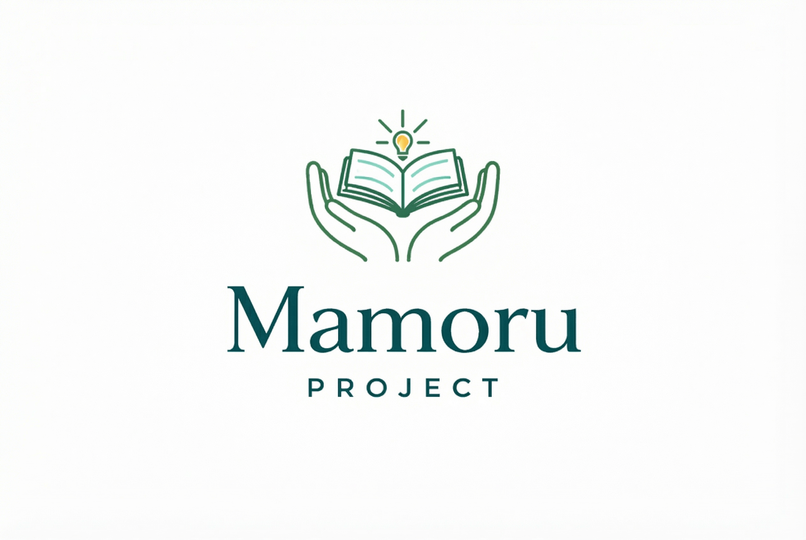
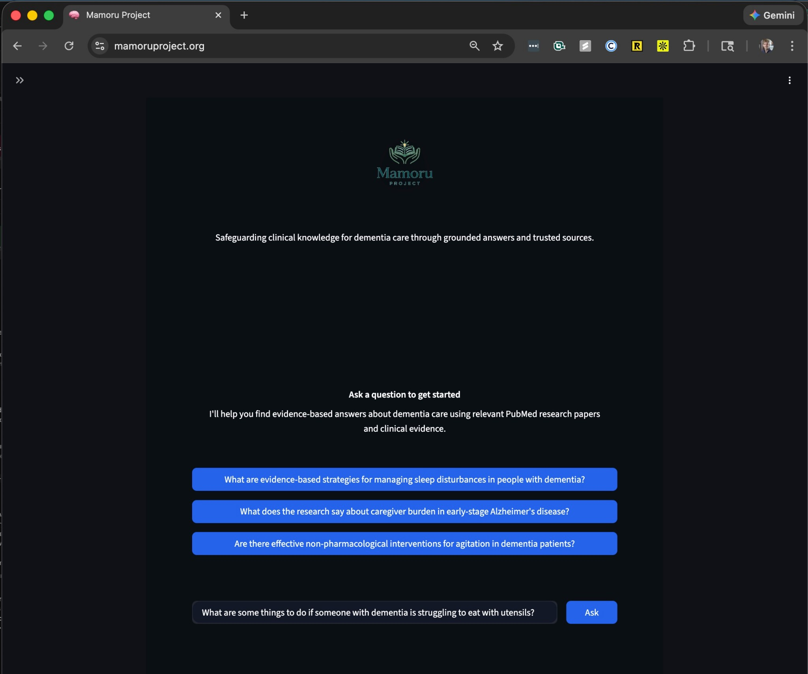
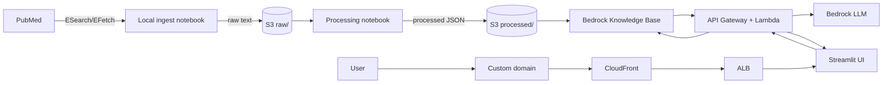

# Mamoru Project: A PubMed RAG Based System

This project builds an AWS-hosted retrieval-augmented generation system using papers from PubMed to answer caregiver and clinician-oriented questions about dementia progression and care using peer-reviewed clinical literature. It was created as part of an interview process and then expanded. See [Architecture Overview](#architecture-overview) and the [Architecture diagrams](ARCHITECTURE.md) (Cloud Deployment, Data Ingestion, Bedrock zoom-in) to learn more, and our [mock pitch deck](https://docs.google.com/presentation/d/1pU9SLoW5Ash5Qy7y0O62F0xYvQ3ghYX6LY4keAH-xtI/edit?usp=sharing) for where things may go next.

## Contents
- [The Story of Mamoru Project](#the-story-of-mamoru-project)
- [How To Use The Product](#how-to-use-the-product)
- [Architecture Overview](#architecture-overview) → [ARCHITECTURE.md](ARCHITECTURE.md) (diagrams)
- [Repository Layout](#repository-layout)
- [Development Approach](#development-approach)
- [ADRs](#adrs)
- [Contributing](#contributing)
- [Local Development](#local-development)
- [GitHub Actions](#github-actions)
- [Infrastructure](#infrastructure)
- [Data Pipeline](#data-pipeline)
- [Operations](#operations)
- [Future Roadmap](#future-roadmap)

## The Story of Mamoru Project
Mamoru (守る) is a Japanese verb that means to protect, to safeguard, to watch over.
It’s often used not for objects, but for people, traditions, and responsibilities entrusted to someone’s care.

Mamoru Project is built on that idea.

As people age or experience cognitive decline, knowledge doesn’t disappear; it becomes something others must hold, protect, and carry forward. Caregivers, clinicians, and families step into that role every day, often without clear, trustworthy tools to help them make sense of complex medical information.

## How To Use The Product
1. Go to https://mamoruproject.org/
2. Ask your questions and review the response + sources.



## Architecture Overview
**[→ Full architecture with three diagrams](ARCHITECTURE.md)**

For those interested in how Mamoru was built, at a high level it’s end-to-end RAG over PubMed: we pull literature via NCBI E-utilities, chunk and embed text, store vectors in a Bedrock Knowledge Base, and expose a single-turn Q&A API plus a minimal Streamlit UI so answers are grounded in retrieved snippets and citeable. Under the hood, Bedrock was chosen for both embeddings and generation so inference and vector search stay in one place and we avoid moving large payloads.

The design is intended to leverage AWS services where possible so operators can deploy and manage instances of the product in AWS with minimal effort. Ideally this template can be expanded for other use cases beyond dementia care (e.g. other PubMed-backed domains or different data sources).

The diagram below shows two flows. **Ingest (top)**: PubMed → fetch notebook → raw text in S3 → processing notebook → chunked JSON in S3 → sync into the Knowledge Base. **Query (bottom)**: User → custom domain → CloudFront → ALB → Streamlit UI; the UI calls API Gateway + Lambda, which retrieves from the KB, runs the Bedrock LLM with retrieved context, and returns the answer and sources.



## Repository Layout
- `api/`: Lambda handlers for ingest + query.
- `ui/`: Streamlit app.
- `docs/adr/`: Architecture Decision Records.
- `notebooks/`: Local exploration notebooks.
- `terraform/`: AWS infrastructure (S3, Bedrock KB, API, Streamlit).
- `assets/`: Project images (logo, screenshots).

## Development Approach
Given time constraints, our initial implementation sprint focused most on the search/fetch notebook and the
query + ingest handlers, which were heavily influenced by the [boto3](https://boto3.amazonaws.com/v1/documentation/api/latest/reference/services/bedrock-agent-runtime.html) and [Biopython](https://biopython.org/docs/latest/Tutorial/chapter_entrez.html) docs.
The Terraform and Streamlit logic were stubbed out and adapted using a Plan and
Execute workflow similar to Eric Ma's approach, using Cursor and GPT-5.2 Codex
in a chaperoned fashion ([source](https://www.youtube.com/watch?v=YuA_9x1aSZ4)).
I intentionally skipped adding full static typing to the Python code here, but in a longer-lived production service I would normally add type hints and a type checker (for example, mypy or Pyright) to keep the codebase safer to change.

## ADRs
As part of the development of this project, several decisions were made; see the decision logic in the [ADR folder](docs/adr/). Additional key decisions should also be documented there.

## Contributing
This repo includes a `Makefile` with common development tasks. For running the app and ingestion locally, see [Local Development](#local-development). For day-to-day contribution:

- Set up pre-commit hooks: `make precommit-install`
- Run tests: `make test`
- Dev/test dependencies live in `requirements-dev.txt` (installed by `make setup`).
- Notebooks are formatted with `nbqa black notebooks/` (pre-commit runs this on `.ipynb` files).
- Currently, motebook outputs are committed so readers can see results without running. Do not add cells that print secrets (API keys, tokens, full env). Use `make clean-notebooks` to strip outputs before commit if needed.

See `Makefile` for all available targets: `setup`, `precommit-install`, `precommit-run`, `clean-notebooks`, `test`, `run-ui`, `run-fetch`, `run-process`, `terraform-init`, `terraform-validate`, `terraform-plan`, `terraform-apply`, `build-ui`, `build-push-ui`, `bump-patch`, `bump-minor`, `bump-major`, `tag-release`.

If you want to propose changes, open a pull request so it can be reviewed.

## Local Development

### Running Streamlit UI Locally

You can run the Streamlit site locally pointed at an AWS-hosted Knowledge Base. You need **Python** (e.g. 3.14.x) and [Docker](https://www.docker.com/) is required for building/pushing the UI image (see Deployment); These instructions were tested on macOS; Linux users should adjust things as needed.

**Steps**

1. Clone and enter the repo: `git clone https://github.com/adzuci/pubmed-rag-system.git && cd pubmed-rag-system`
2. Run `make setup`.
3. Run `make run-ui`.

The app opens at `http://localhost:8501` and uses the deployed API by default. Set `RAG_API_URL` in `.env` to use a different endpoint.

### Running Data Ingestion Locally
You can run the fetch and process notebooks locally. Use make targets so you don’t need to activate a venv manually.

**Steps**

1. Run `make setup` (if you haven’t already).
2. Copy the example and create a `.env` (gitignored): `cp .env.example .env`, then edit with at least:
   - `NCBI_EMAIL=you@example.com`
   - `NCBI_API_KEY=your_key_here` (optional; get one at [NCBI account settings](https://www.ncbi.nlm.nih.gov/account/settings/))
   - `S3_BUCKET=your-bucket`
   - `BEDROCK_KB_ID=kb-XXXXXXXXXX`
   - `BEDROCK_MODEL_ARN=...` (optional)
   - `RAG_API_URL=...` (optional, for Streamlit UI)
   - `OPENSEARCH_ADMIN_PRINCIPAL=arn:aws:iam::ACCOUNT_ID:user/USERNAME` or `arn:aws:iam::ACCOUNT_ID:role/ROLE_NAME` (optional, for Terraform OpenSearch access; auto-detected from current AWS identity)
3. Run the fetch notebook (non-interactive): `make run-fetch`. Output goes to `notebooks/_runs/`.
4. Run the process notebook (non-interactive): `make run-process`. If `S3_BUCKET` is set in `.env`, the notebook will upload the processed output to S3; if unset, it skips upload and keeps output locally.

To work in the notebooks interactively: `jupyter notebook`, then open `notebooks/pubmed_search_and_fetch.ipynb` or `notebooks/pubmed_processing_analysis.ipynb`.

### Testing Prompts and RAG Locally
Use the RAG prototype notebook to try prompt-engineering and retrieval locally against the Knowledge Base (no UI or Lambda).

**Steps**

1. Run `make setup` (if you haven’t already).
2. Ensure `.env` has `BEDROCK_KB_ID` and `BEDROCK_MODEL_ARN` (same as for ingestion).
3. Open the notebook in Jupyter or your IDE and run the cells to run retrieval + generation and iterate on prompts:
   ```bash
   jupyter notebook notebooks/pubmed_rag_prototype.ipynb
   ```

## GitHub Actions
All workflows live in `.github/workflows/`:
- **Tag release**: On merge to `main`, create a tag `v<VERSION>` when the `VERSION` file changes.
- **Tests + Black**: On PRs, run `make precommit-run` and `make test`.
- **ECR push**: On merge to `main`, build/push `pubmed-rag-ui-repo:v<VERSION>` to ECR only when `VERSION` changes.

**Repo Variables** (non-secret):
- `AWS_REGION` (e.g. `us-east-1`)
- `AWS_ACCOUNT_ID` (e.g. `934888692597`)

**Repo Secrets**:
- `AWS_ACCESS_KEY_ID`
- `AWS_SECRET_ACCESS_KEY`

## Infrastructure

### Terraform
Current Terraform covers:
- **S3** bucket for raw/processed corpus storage
- **Bedrock Knowledge Base** RAG backend (vector store backed by OpenSearch Serverless)
- **Secrets Manager** secret for NCBI credentials (`ncbi_email`, `ncbi_api_key`)
- **Lambda functions** for ingestion and querying
- **API Gateway** HTTP Gateway for Lambdas
- **Streamlit app** hosted in Elastic Container Service
- **Route53 + CloudFront** for custom domain
- **Alerts**: CloudWatch alarms (Lambda errors, Streamlit 5xx)

Tags are applied via the `tags` variable (default: `project=pubmed-rag-system`, `env=production`, a staging environment may be added late).

Required inputs:
- `bucket_name` (no default)
- `ncbi_email` (no default)

See `terraform/README.md` for detailed Terraform documentation.

### Deployment

**Note**: Ensure your domain registrar (e.g. `mamoruproject.org`) points to the correct Route 53 hosted zone (or add the domain manually in your DNS provider) before expecting ACM validation to complete.

#### Using Makefile Targets

The Makefile provides convenient targets for Terraform operations:

- `make terraform-init` - Initialize Terraform (run once, or after adding providers)
- `make terraform-validate` - Validate Terraform configuration
- `make terraform-plan` - Show planned changes
- `make terraform-apply` - Apply Terraform changes
- `make build-push-ui` (or `make build-ui`) - Build Streamlit Docker image and/or push to ECR

#### Deployment Steps

1) **Initialize Terraform** (first time only):
   ```bash
   make terraform-init
   ```

2) **Plan and apply core infrastructure**:
   ```bash
   make terraform-plan
   make terraform-apply
   ```
   
   If a full apply fails (e.g. OpenSearch 403 or dependency ordering), apply in two phases. **Phase 1**: targeted apply for core resources (S3, secrets, Bedrock, Lambda, API). **Phase 2**: run `terraform apply` again with no `-target` to create Streamlit, domain, alarms, and the rest.
   ```bash
   cd terraform
   terraform plan -target=aws_s3_bucket.data -target=aws_s3_bucket_versioning.data -target=aws_s3_bucket_server_side_encryption_configuration.data -target=aws_s3_bucket_public_access_block.data -target=aws_secretsmanager_secret.ncbi_credentials -target=aws_secretsmanager_secret_version.ncbi_credentials -target=module.bedrock -target=aws_iam_role.rag_lambda -target=aws_iam_role_policy.rag_lambda -target=aws_lambda_function.rag_query -target=aws_apigatewayv2_api.rag_api -target=aws_apigatewayv2_integration.rag_api -target=aws_apigatewayv2_route.rag_query -target=aws_apigatewayv2_stage.rag_api -target=aws_lambda_permission.rag_api
   terraform apply
   # Phase 2: create remaining resources if needed (Streamlit, domain, alarms)
   terraform plan && terraform apply
   ```

3) **Build and push Streamlit image**:
   ```bash
   make bump-patch  # Bump version first (or bump-minor/bump-major)
   make build-push-ui
   ```
   To only build the image locally (no AWS creds), use `make build-ui`.
   **Important**: Always bump the version (`make bump-patch`, `make bump-minor`, or `make bump-major`) before deploying a new image. This ensures ECS pulls the new image instead of using a cached version. The version is automatically passed to Docker as a build argument and written to the container.
   
   After building the image, run `make terraform-plan && make terraform-apply` to update the infrastructure with the new image version.

   **Note**: When updating `ui/app.py`, ensure `streamlit_app_version` in `terraform/variables.tf` is aligned with `VERSION` before applying. The `build-push-ui` target uses `VERSION` automatically, and `bump2version` updates both files.

4) **Set the NCBI secret value**:
   - The Terraform apply creates the secret but does not populate values.
   - Console:
     - Open the secret in Secrets Manager and set the JSON value for `ncbi_email` and `ncbi_api_key`:
       - `{"ncbi_email":"you@example.com","ncbi_api_key":"REPLACE_ME"}`
   - CLI (example):
     - `aws secretsmanager put-secret-value --secret-id pubmed-ncbi-credentials --secret-string '{"ncbi_email":"you@example.com","ncbi_api_key":"REPLACE_ME"}'`

### RAG API + Streamlit UI
Terraform provisions a Lambda-backed HTTP API for RAG queries and an optional serverless Streamlit app. The UI can use the API endpoint from Terraform outputs:
- `rag_api_endpoint` (HTTP API base URL)
- `streamlit_cloudfront_url` (Streamlit UI URL)

## Data Pipeline

### PubMed Ingest

#### Manual Ingest Trigger
Invoke the ingest Lambda manually to pull new PubMed records into `raw/`:
- `aws lambda invoke --function-name <pubmed_ingest_lambda_name> --payload '{}' /tmp/ingest.json`
- Adjust query or limits by updating Terraform variables: `pubmed_query`, `pubmed_retmax`, `pubmed_batch_size`

The knowledge base uses a curated subset of dementia and caregiver-related peer-reviewed articles from PubMed to inform research-backed answers.

#### Secrets + Scheduling
- Secrets: store `NCBI_EMAIL` and `NCBI_API_KEY` in AWS Secrets Manager
- Scheduling: use EventBridge to trigger a Lambda (or ECS task) for periodic ingest.
- Details: `docs/ops/scheduled_ingest.md`

#### Troubleshooting OpenSearch Permissions
If you encounter a 403 Forbidden error when creating the OpenSearch index, the access policy may need to be refreshed. The policy should automatically include your current user ARN, but if issues persist:

1. Verify your user ARN is in the access policy:
   ```bash
   aws opensearchserverless get-access-policy --name os-access-pubmed-rag-api --type data --region us-east-1
   ```

2. If needed, manually update the policy to include your user ARN (the policy name format is `os-access-<prefix>` where prefix is the first 16 chars of `rag_api_name`).

3. Ensure `OPENSEARCH_ADMIN_PRINCIPAL` in `.env` matches your IAM user or SSO role ARN (optional, as it's auto-detected from `aws sts get-caller-identity`). For SSO users, you may need to add the SSO role ARN explicitly:
   ```bash
   # Find your SSO role ARN
   aws iam list-roles --query "Roles[?contains(RoleName, 'SSO')].Arn" --output text
   # Add it to .env as OPENSEARCH_ADMIN_PRINCIPAL
   ```

## Operations

### Query Logs
The Streamlit UI logs each question (and client IP when available) to stdout. When deployed, these logs are available in CloudWatch Logs under the ECS log group created by the module:
- Log group: `/ecs/<app_name>-ecs-log-group`
- Filter example (CloudWatch Logs Insights): `fields @timestamp, @message | filter @message like /rag_query:/ | sort @timestamp desc`
- CLI with timestamps and IPs (jq; last 7 days):
  ```bash
  aws logs filter-log-events \
    --log-group-name "/ecs/pubmed-rag-ui-ecs-log-group" \
    --filter-pattern "rag_query" \
    --start-time $(($(date +%s) - 604800))000 \
    --output json |
  jq -r '.events[] | "\(.timestamp / 1000 | strftime("%Y-%m-%d %H:%M:%S"))\t\(.logStreamName)\t\(.message)"'
  ```
  Output is tab-separated: timestamp (UTC), log stream name, message (includes client IP and question when the app logs it).

### Cleanup
- `terraform destroy` to remove AWS resources created by this repo.
- Remove generated S3 data under `s3://<bucket>/raw/` and `s3://<bucket>/processed/` if needed.
- Unsubscribe and delete SNS topics if you no longer want alerts.
- Delete ECR images for the Streamlit app if you no longer need the UI.

### Estimated Cost
Assumptions: 500 documents ingested,
weekly ingest run, 100–1,000 Q&A requests per month, and a single Streamlit task.

- **Baseline infra** (OpenSearch Serverless + ECS/ALB + CloudFront): ~`$75–$200/mo` with light traffic.
- **Bedrock per-request**: typically `low cents` per request.
  Roughly `~$1–$10/mo` for ~100 queries, `~$10–$100/mo` for ~1,000 queries
  (depends on model choice and response length).
- **Ingest processing (Lambda)**: usually `<$1–$5/mo` for a small weekly run.
  If you run daily or process thousands of documents, expect `~$5–$20/mo`.
- **S3 + CloudWatch**: usually `a few dollars` unless data or logs grow large.

## Future Roadmap
Once the product is considered viable, possible next steps include:
1. Modifying query handler to respond gracefully when unreasonable or non-caregiver related prompts are given.
1. Adding auth, encoding the API endpoint and setting per-user rate limits.
1. Migrating away from Streamlit to a static React frontend behind a WAF, and reviewing CIS benchmarks / hardening the production environment.
1. Creating a dedicated stage environment and wiring up CI/CD to promote changes from stage to prod.
1. Locking down credentials further (e.g., narrower IAM policies, secret rotation).
1. Expanding test coverage for Lambdas, data parsing, and infra integration flows.
1. Implementing LangChain evaluation framework to measure RAG quality (faithfulness, answer relevance, context precision) and track improvements over time.
1. Expanding ingest to pull full article content from PubMed Central when available, falling back to abstracts for articles without open access full text.
